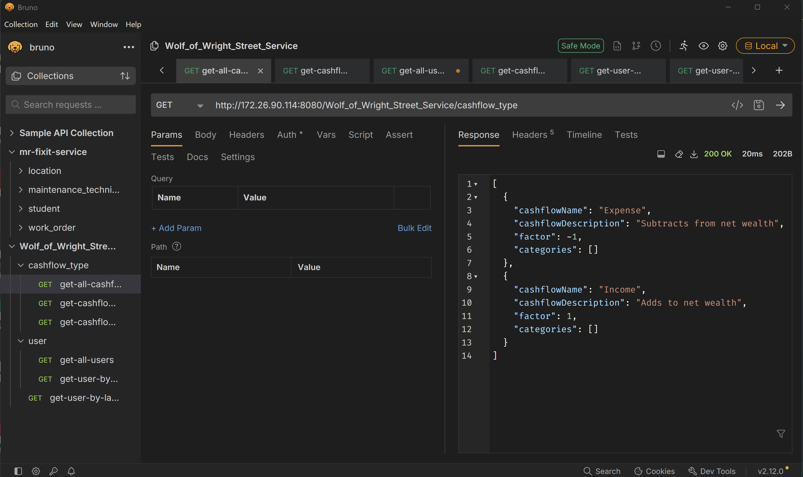
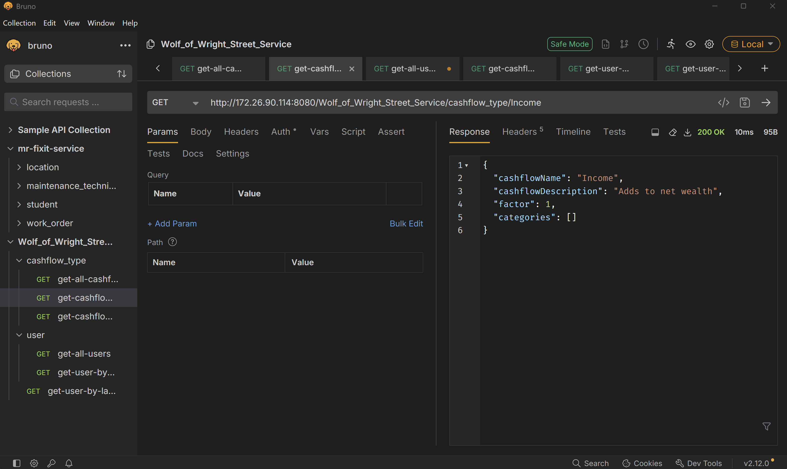
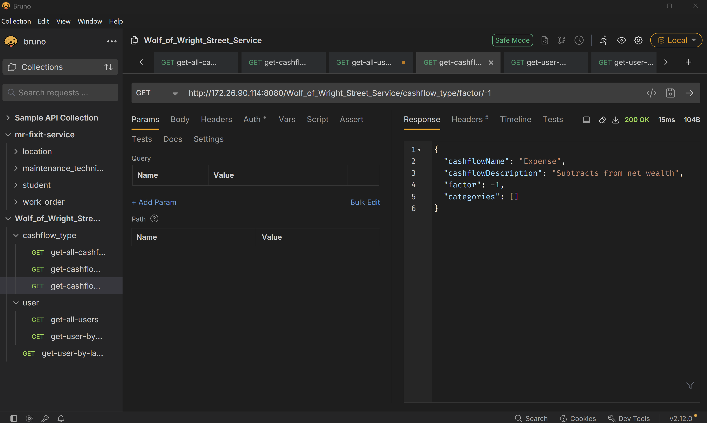

# Homework 2
As a note, these screenshots feature the IP of my WSL2 instance instead of localhost -- could not figure out how to get it working. TODO: probably add a config file for {BASE}.

## GET Request (All Cashflow Types)

## GET Request (Cashflow Type by Name)

## GET Request (Search Cashflow Type by Factor)

### GET Request (All Users)

### GET Request (User by ID)

### GET Request (User by last name)

